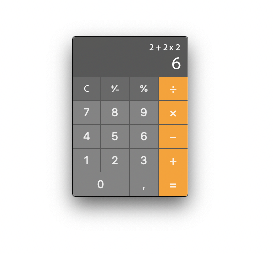

# test-2020-09-05

> 

> Реализовать калькулятор на VueJS в соответствии с картинкой.
В верхней части отображается текущий буфер ввода, с указанием операций ввода.
Ниже отображается результат вычислений для данного буфера

> Кнопка “С” сбрасывает буфер и обнуляет результат вычислений
Кнопка “=” сбрасывает буфер, затем переносит результат вычисления в буфер сверху

> Символы, не помещающиеся по ширине, скрываем (обрезаем) слева

---
## Проект опубликован на Netlify:
https://a-rusak-test-2020-09-05.netlify.app/

---

## Project setup
```
npm install
```

### Compiles and hot-reloads for development
```
npm run serve
```

### Compiles and minifies for production
```
npm run build
```

### Run your unit tests
```
npm run test:unit
```

### Run your end-to-end tests
```
npm run test:e2e
```

### Lints and fixes files
```
npm run lint
```
